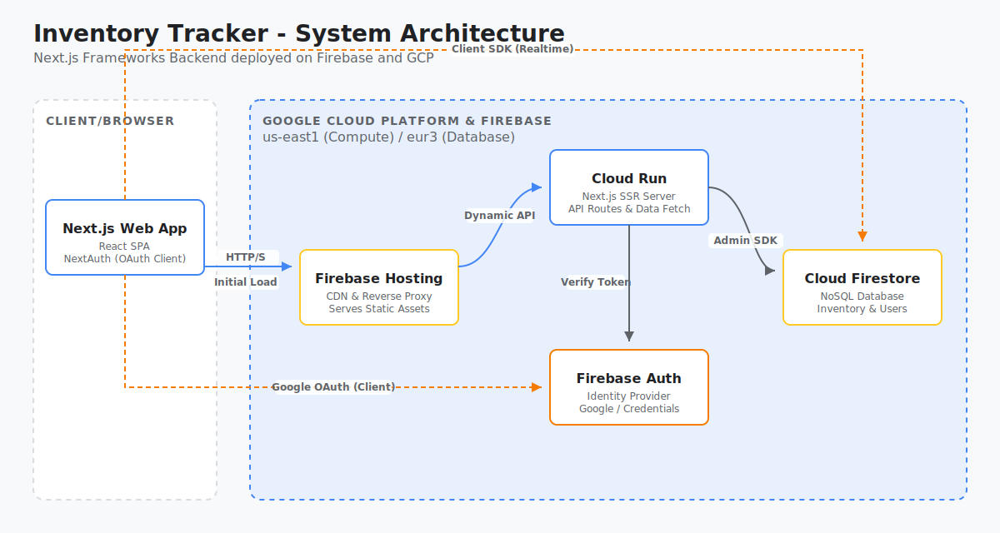

# Project Tracker 🚀

A high-performance, multi-tenant **Team Budgeting & Capacity Planning** platform built with **Next.js 15**, **Prisma**, and **Auth.js v5**. Designed for organizational transparency, strategic forecasting, and enterprise-grade accountability.



## ✨ Core Features

### 🏢 Multi-Tenant Management
- **Organization Isolation**: Secure, top-level `Organization` partitioning for all data (Teams, Projects, Allocations).
- **Hierarchical Teams**: Manage nested team structures with active/inactive status and cross-project assignments.
- **Project Portfolios**: Categorize initiatives with metadata, status tracking, and department-level ownership.

### 📅 Strategic Capacity Planning
- **Interactive Planning Grid**: High-performance, spreadsheet-like interface for monthly capacity forecasting.
- **Real-Time Totaling**: Instant feedback on team capacity utilization and project-level budget allocations.
- **Auto-Save Resilience**: Durable, throttled server-side persistence for bulk grid updates.

### 📊 Executive Reporting & Variance
- **Plan vs. Actual Analysis**: Interactive **Recharts** dashboards contrast forecasted hours against real-world delivery.
- **Resource Accuracy Layer**: High-level KPIs calculate organizational variance and forecasting precision.
- **Team-Level Allocations**: Dynamic breakdowns showing resource distribution across the entire organization.

### 📥 Data Ingestion & Actuals
- **Bulk Actuals Importer**: Rapidly ingest work history from external tracking software via CSV using **PapaParse**.
- **Data Validation**: Real-time column mapping and preview layer to ensure accurate historical attribution.

### 🛡️ Enterprise Audit Trail
- **Traceability Explorer**: Searchable history of every administrative mutation (Create, Update, Delete).
- **Visual Change Inspector**: Side-by-side "Previous Value" vs. "New Value" diffing for absolute accountability.
- **Tenant-Level Logs**: Securely partitioned audit records ensure data privacy and historical integrity.

## 🛠️ Tech Stack

- **Framework**: [Next.js 15](https://nextjs.org/) (App Router, Server Actions)
- **Database**: [Google Cloud SQL](https://cloud.google.com/sql/) (PostgreSQL)
- **Connector**: Official [Node.js Cloud SQL Connector](https://github.com/GoogleCloudPlatform/cloud-sql-nodejs-connector)
- **ORM**: [Prisma](https://www.prisma.io/) (v7.5.0) with Driver Adapters
- **Auth**: [Auth.js v5](https://authjs.dev/) (Beta-25+)
- **Charts**: [Recharts](https://recharts.org/)
- **Parsing**: [PapaParse](https://www.papaparse.com/)
- **Icons**: [Lucide React](https://lucide.dev/)
- **Styling**: Premium Glassmorphic Vanilla CSS (CSS Variables)

## 🚀 Getting Started

### 1. Prerequisites
- Node.js 18+
- A Google Cloud Project with Cloud SQL (PostgreSQL) enabled.

### 2. Environment Setup
Create a `.env` file in the root directory:

```env
# Database (Cloud SQL Format)
# Use the 'host=' parameter for the Instance Connection Name
DATABASE_URL="postgresql://user:password@/dbname?host=PROJECT:REGION:INSTANCE"

# Authentication
AUTH_SECRET="..." # Generate with: npx auth secret
AUTH_URL="https://your-app.web.app"
NEXTAUTH_URL="https://your-app.web.app"
AUTH_TRUST_HOST="true"

# Providers
GOOGLE_CLIENT_ID="..."
GOOGLE_CLIENT_SECRET="..."
```

### 3. Installation & Local Development
```bash
# Install dependencies
npm install

# Generate Prisma Client (uses driverAdapters)
npx prisma generate

# Run development server
npm run dev
```

## 🏗️ Deployment

Optimized for **Firebase Hosting** and **Google Cloud Run** via the Firebase CLI:

```bash
# Deploy to Production
firebase deploy
```

---
Developed with precision for modern organizational delivery.
