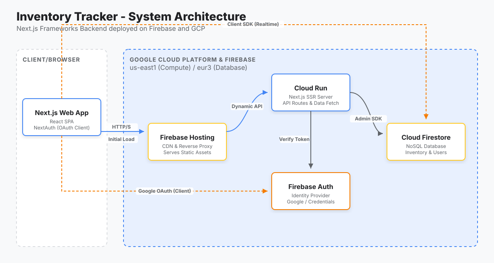
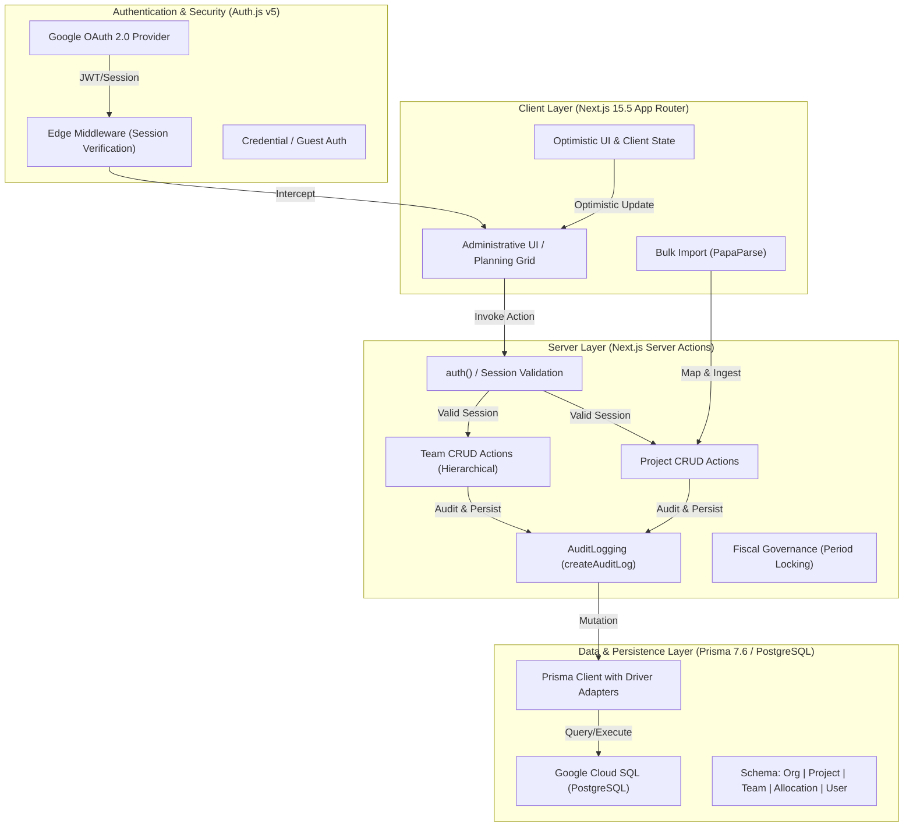

# Project Tracker 🚀

A high-performance, multi-tenant **Team Budgeting & Capacity Planning** platform built with **Next.js 15.5**, **Prisma 7.6**, and **Auth.js v5**. Designed for organizational transparency, strategic forecasting, and enterprise-grade administrative governance.



## 🧩 Logical Architecture


```mermaid
graph TD
    subgraph "Client Layer (Next.js 15.5 App Router)"
        UI["Administrative UI / Planning Grid"]
        UI_State["Optimistic UI & Client State"]
        ImportCLI["Bulk Import (PapaParse)"]
    end

    subgraph "Authentication & Security (Auth.js v5)"
        Middleware["Edge Middleware (Session Verification)"]
        GoogleAuth["Google OAuth 2.0 Provider"]
        CredentialAuth["Credential / Guest Auth"]
    end

    subgraph "Server Layer (Next.js Server Actions)"
        AuthAction["auth() / Session Validation"]
        ProjectCRUD["Project CRUD Actions"]
        TeamCRUD["Team CRUD Actions (Hierarchical)"]
        AuditLogAction["AuditLogging (createAuditLog)"]
        FiscalAction["Fiscal Governance (Period Locking)"]
    end

    subgraph "Data & Persistence Layer (Prisma 7.6 / PostgreSQL)"
        PrismaClient["Prisma Client with Driver Adapters"]
        CloudSQL["Google Cloud SQL (PostgreSQL)"]
        Schema["Schema: Org | Project | Team | Allocation | User"]
    end

    %% Logical Flow
    UI -- "Invoke Action" --> AuthAction
    AuthAction -- "Valid Session" --> ProjectCRUD
    AuthAction -- "Valid Session" --> TeamCRUD
    ProjectCRUD -- "Audit & Persist" --> AuditLogAction
    TeamCRUD -- "Audit & Persist" --> AuditLogAction
    AuditLogAction -- "Mutation" --> PrismaClient
    PrismaClient -- "Query/Execute" --> CloudSQL
    Middleware -- "Intercept" --> UI
    GoogleAuth -- "JWT/Session" --> Middleware
    UI_State -- "Optimistic Update" --> UI
    ImportCLI -- "Map & Ingest" --> ProjectCRUD
```

## ✨ Core Features

### 🛡️ Administrative Command Center
- **Full CRUD Suite**: Integrated management for **Projects**, **Teams**, and **Users** with real-time optimistic UI updates.
- **Multi-Team Architecture**: Projects support flexible many-to-many relationships, allowing cross-functional initiatives across multiple teams.
- **Hierarchical Teams**: Visual, editable team structures supporting parentage management and organizational nesting.
- **Secure Onboarding**: Administrative invitation system with role pre-assignment and organizational isolation.

### 📅 Strategic Capacity Planning (Bulk Mode)
- **9-Week Rolling Window**: High-performance planning horizon (Today + 8 Weeks) with **TanStack Table v8**.
- **Real-Time Totaling**: Instant feedback on team capacity utilization (Σ) and project-level budget allocations.
- **Cross-Team Allocations**: Track project allocations for specific teams across shared initiatives.
- **Blur-Sync Persistence**: Durable, throttled server-side persistence for bulk grid updates.

### 📊 Executive Reporting & Variance
- **Plan vs. Actual Analysis**: Interactive **Recharts** dashboards contrast forecasted hours against real-world delivery.
- **Fiscal Governance**: **Period Locking** mechanism to prevent unauthorized modifications to finalized fiscal data.
- **Resource Accuracy Layer**: High-level KPIs calculate organizational variance and forecasting precision.

### 📥 Data Ingestion & Actuals
- **Bulk Actuals Importer**: Rapidly ingest work history from external tracking software via CSV using **PapaParse**.
- **Data Validation**: Real-time column mapping and preview layer to ensure accurate historical attribution.

### 🕵️ Enterprise Audit Trail
- **Traceability Explorer**: Persistent, searchable history of every administrative mutation (Create, Update, Delete).
- **Visual Change Inspector**: Side-by-side "Previous Value" vs. "New Value" diffing for absolute accountability.
- **Tenant-Level Logs**: Securely partitioned audit records ensure data privacy and historical integrity.

- **Firebase Native**: Optimized for **Firebase Hosting (Frameworks V2)** with SSR support in `europe-north1`.

## 🚀 Phase 14: Relational Evolution & Many-to-Many Finalization

The platform has undergone a major architectural shift to a **Many-to-Many** relationship between Projects and Teams, resolving the "Singular Team" limitation and hardening the system against regression.

- **Many-to-Many Database Migration**: Projects now support assignment to multiple teams simultaneously via a join table.
- **Relational Integrity Hardening**: Audit trails, Reports, and Planning views have been refactored to handle multi-team associations with zero runtime overhead.
- **Mock Data Layer 2.0**: Enhanced the `mockData.ts` high-fidelity mock to explicitly handle uninitialized relational arrays, preventing 500 errors in local development.
- **Font & Production Optimization**: Standardized typography using `next/font/google` for improved CLS and production build stability.

## 🛠️ Tech Stack

- **Framework**: [Next.js 15.5](https://nextjs.org/) (App Router, Server Actions)
- **Database**: [Google Cloud SQL](https://cloud.google.com/sql/) (PostgreSQL)
- **Connector**: Official [Node.js Cloud SQL Connector](https://github.com/GoogleCloudPlatform/cloud-sql-nodejs-connector)
- **ORM**: [Prisma](https://www.prisma.io/) (v7.6.0) with Driver Adapters
- **Auth**: [Auth.js v5](https://authjs.dev/) (v5.0.0-beta.30+)
- **Charts**: [Recharts](https://recharts.org/)
- **Parsing**: [PapaParse](https://www.papaparse.com/)
- **Styling**: Premium Glassmorphic Vanilla CSS (CSS Variables)

## 🚀 Getting Started

### 1. Prerequisites
- Node.js 18+ (v20+ recommended)
- A Google Cloud Project with Cloud SQL (PostgreSQL) enabled.

### 2. Environment Setup
Create a `.env` file in the root directory:

```env
# Database (Cloud SQL Format)
DATABASE_URL="postgresql://user:password@/dbname?host=PROJECT:REGION:INSTANCE"
MOCK_DATABASE="true" # Set to true to bypass Cloud SQL for local UI development

# Authentication
AUTH_SECRET="..." # Generate with: npx auth secret
AUTH_URL="https://your-app.web.app"
AUTH_TRUST_HOST="true"

# Google OAuth
GOOGLE_CLIENT_ID="..."
GOOGLE_CLIENT_SECRET="..."
```

### 3. Installation & Local Development
```bash
# Install dependencies
npm install

# Generate Prisma Client
npx prisma generate

# Run development server
npm run dev

# Inspect Data
# You can use npx prisma studio to view and edit your local data in the browser.
```

## 🏗️ Deployment

Optimized for **Firebase Hosting** and **Google Cloud Run** via the Firebase CLI:

```bash
# Deploy to Production
firebase deploy
```

---
**Developed with precision for modern organizational delivery.**
